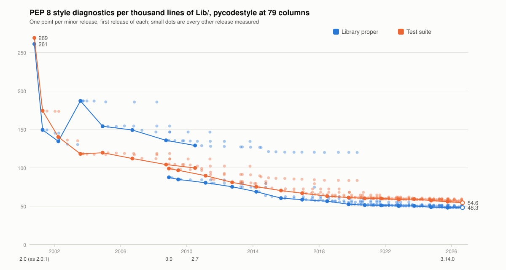
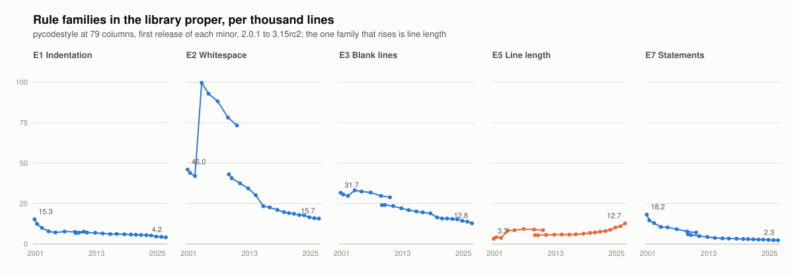
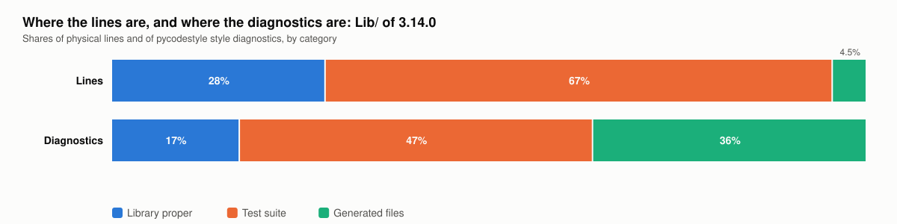
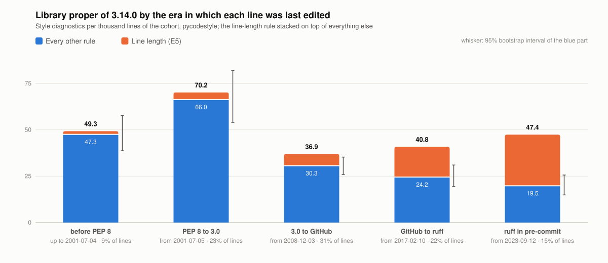
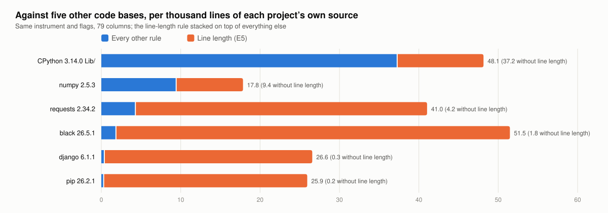

# Results — 2026-09-29

Every number below is reproducible from this tree with `make fetch`,
`make measure` and `make results`, plus `make cpython` and `make analyses`
for everything from the age cohorts on, against the tarballs whose digests
are in [data/tarballs.sha256](data/tarballs.sha256), the CPython tag
`v3.14.0`, and the five baseline sdists pinned by SHA-256 in
`data/baselines/`, with pycodestyle 2.15.0 and ruff 0.14.4 under Python
3.14 (`uv.lock`). Protocol, categories and metrics: [PROTOCOL.md](PROTOCOL.md);
read *Known problems* there before citing anything. The instrument line and
the tables are `make results`'s output, pasted verbatim; the reading is
written by hand and says which table it reads from. Every release python.org
offers is measured, 264 of them from 2.0.1 to 3.14.7, plus the second
release candidate of 3.15.0 as a provisional point; the series is the first
release of each minor, and everything else is the sensitivity set, summarised
per minor.

## Reading the series

- **The library proper conforms to PEP 8 about twice as well as it did in
  3.0.** Its density fell from 87.6 to 48.1 style diagnostics per thousand
  lines between 3.0 (2008) and 3.14.0 (2025), and it fell at every step but
  one (3.11 → 3.12, +0.2). The test suite fell from 99.1 to 56.0. Both
  instruments agree within 2.5 % at every point (series table, columns
  `stdlib /k`, `tests /k`, `/k`). The second release candidate of 3.15.0,
  measured as a stand-in until the final ships, continues the line at 48.3.
- **Python 2 was worse, and differently.** 2.0.1's library proper runs at
  261 per thousand lines and 2.7's at 129, against 3.0's 87.6. Half of
  2.0.1's count is W191, indentation with tabs, 129 per thousand lines and
  gone by 2.7; 2.7's whitespace family (73) is nearly twice 3.0's (43),
  which is the code written between PEP 8 and 3.0 that the cohort table
  also singles out (series and family tables).
- **Every rule family fell but one: line length.** In the library proper
  E5 rose from 5.5 to 10.9 per thousand lines, and E501 is the only rule in
  the top twenty with more instances in 3.14.0 (2951) than in 3.0 (886).
  Whitespace (E2) fell from 43.1 to 16.0, blank lines (E3) from 24.0 to
  13.8, statements (E7) from 6.0 to 2.4, indentation (E1) from 6.7 to 4.4.
  The W families are zero throughout 3.x: CPython has stripped trailing
  whitespace since before 3.0; W605 (invalid escape sequence) went from 159
  to 0 once Python itself began warning about it in 3.6 (family and rule
  tables).
- **The semantic rules are a rounding error.** The rules about what the
  code does (comparisons to None and booleans, bare excepts, lambda
  assignments, ambiguous names, deprecations) run at 1.1 per thousand
  lines in 3.14.0, down from 2.9 in 3.0 and 5.0 in 2.0.1: 308 instances,
  149 of them bare excepts. Ninety-eight per cent of the headline is layout
  (severity tables).
- **Naming is where PEP 8 exempts itself.** The naming rules fell from
  12.8 to 8.0 per thousand lines between 3.0 and 3.14.0. Of the 2185
  instances in 3.14.0, 883 are function names that are not lowercase, and
  they sit in `xml` (317, the W3C DOM's names), `unittest` (150), `idlelib`
  (114), `logging` (84) and `multiprocessing` (47): the mixedCase APIs that
  PEP 8 allows "where that's already the prevailing style". By era of last
  edit they run 20.6, 10.4, 6.4, 4.3 and 5.9 (naming tables, era table).
- **What remains is layout, not code.** After line length, E302 (two blank
  lines before a top-level definition) is the largest rule left, 2457
  instances, about its 3.0 count; E261 comment spacing and E203 whitespace
  before `:` follow. The rules that describe the shape of code fell three-
  to sixteen-fold: E231 comma spacing 2342 → 895, E225 operator spacing
  725 → 274, E701 several statements on a line 616 → 283, E301 761 → 294,
  E211 whitespace before `(` 275 → 17 (rule table).
- **Where the diagnostics are.** In 3.14.0 the library proper holds 17 %
  of all diagnostics on 28 % of the lines, the test suite 47 % on 67 %, and
  78 generated files, 4.5 % of the lines, hold 36 %: 645 per thousand
  lines, because the charmap codecs are tables of one-line entries with
  two-space inline comments. A count that does not split these measures
  gencodec's output style (category table).
- **Patch releases stay within a few points of their minor's first.**
  Across every 3.x minor the largest drift of the whole-`Lib/` density is
  7.5 per thousand lines (3.4.9 against 3.4.0), and from 3.7 on it is under
  3; the exception is 2.7, whose eighteen patch releases over ten years
  drifted from 167 to 147. That is why the series has one point per minor
  and why averaging patch releases, as in November 2025, hid nothing except
  an instrument change (sensitivity table).
- **Against the 2025 post.** It ran 25 rules at 88 columns and saw 12.5
  → 6.9 per thousand lines from 3.0.1 to 3.13.0, then 17.3 for 3.14.0
  under a different configuration ([validation/README.md](validation/README.md)).
  Where the releases were measured alike the direction was the same as
  here; the level was under a tenth of it (4479 against 59804 diagnostics
  for 3.0.1) because most of pycodestyle was not run.

## Reading the cohorts

Every line of 3.14.0 is dated by the commit that last edited it, and the
diagnostics on it go to that date's cohort (cohort tables; method and
caveats in PROTOCOL.md, *Age cohorts* and Known problems 9 to 11).

- **Apart from line length, code from every era is cleaner than the
  last.** Without E5, the library proper's density by the era of a line's
  last edit is 47.3 before PEP 8, 66.0 from PEP 8 to 3.0, 30.3 from 3.0 to
  the GitHub move, 24.2 from then to the first ruff hook, and 19.5 since
  (era table, `excl. E5 /k`). Whitespace (E2) runs 36.4 → 10.0 → 9.1 →
  5.9 over the last four eras, blank lines (E3) 20.6 → 13.2 → 9.9 → 6.7,
  and in the rules-by-era table E261, E231, E265, E221 and E303 each fall
  eight- to twenty-fold from their peak.
- **The intervals allow it as a trend, not as five separate steps.**
  Bootstrapped over files, the densities without E5 are 30.3 [25.9, 35.3]
  for 3.0 to GitHub, 24.2 [19.4, 31.0] for GitHub to ruff and 19.5 [14.9,
  25.6] since: the direction holds across the three eras and adjacent
  intervals overlap, while the Python 2 era's 66.0 [54.0, 82.0] is clear
  of everything after it. Moving every boundary a year either way shifts
  the middle eras by up to 4 per thousand lines and the newest by nothing;
  source lines as the denominator scale every era by about 1.3 and change
  no ordering (sensitivity table).
- **A second dating changes little.** Blamed with whitespace edits
  ignored and moves and copies followed, the cohorts age a little: the
  share of lines last edited before PEP 8 goes from 9 to 11 %, the newest
  cohort's from 15 to 12 %, so about three points of what reads as
  2023-to-2025 code is older code that was moved or re-indented. The
  densities without E5 move by at most four per thousand lines (66.0 →
  62.4 for the Python 2 era, 24.2 → 22.4 for GitHub to ruff) and keep
  their order (two-datings table).
- **Line length is being abandoned, by a few characters at a time.** E501
  rises from 1.9 per thousand lines in code untouched since before PEP 8
  to 6.5, 16.5 and 27.9 in the three latest eras, and it is why the newest
  cohort's total (47.4) sits above the 2008 to 2017 cohort's (36.9). But
  the long lines are not long: in the newest cohort 2.8 % of lines pass
  79, the median of those is 85 characters and nine in ten are under 99.
  There is no unwritten 88 or 99; there is a 79 missed by a handful of
  characters. Nothing enforces it: CPython's pre-commit runs ruff on the
  test suite, the docs and the tools, not on the library proper, and the
  one rule it enforces on the test suite is F811 (rules-by-era, line
  length and enforcement tables).
- **The 72-column rule is the most broken rule of all.** PEP 8 limits
  docstrings and comments to 72 columns, and pycodestyle checks it only
  when asked. Asked, it reports 10,676 such lines in 3.14.0's library
  proper, 39 per thousand, against 2,991 code lines over 79: the
  docstring limit is broken three and a half times as often as the code
  limit, and it has been since 3.0 (line length tables).
- **Nobody cleans up in passing, which is what PEP 8 asks.** From the 3.8
  branch point (June 2019) to 3.14.0, 73.9 % of the library's lines are
  unchanged and 69.6 % of its violating lines are: a violating line was
  touched four points more often than a line in general, and where the
  line survived, the violation survived 96.5 % of the time. Long lines are
  touched most (37 % changed or removed in six years), surplus blank lines
  least (21 %) (survival table).
- **The worst cohort is Python 2's.** Lines last edited between PEP 8 and
  3.0 carry 70.2 per thousand, more than the pre-PEP 8 survivors (49.3):
  E231 comma spacing 8.7, E261 comment spacing 8.6, E203 whitespace before
  `:` 6.2. This is the code of the large 2002 to 2006 packages together
  with every line the Python 3 conversion rewrote (Known problems 9).
- **The library is old.** 63 % of the library proper's lines were last
  edited before the GitHub move in February 2017 and 9 % before PEP 8
  existed; 15 % were edited in the two years since ruff entered
  pre-commit, and 2024 alone touched 7.4 % (era and year tables).
- **The density is not spread evenly.** `mimetypes` (287 per thousand
  lines), the non-codec modules of `encodings` (213) and `locale` (171)
  are lookup tables with aligned literals, the same shape as the generated
  codecs; `operator` (154) is one-line functions. `asyncio`, the largest
  clean package, runs at 8.9 on 14,909 lines and `dbm` at 6.1. The five
  vendored packages together run at 19.9 on 10,876 lines; without them the
  library proper reads 49.3 instead of 48.1 (packages table).
- **Against other code bases the library is far from PEP 8's layout
  rules.** At the same 79 columns, django runs at 26.6 per thousand lines
  of its proper source, pip at 25.9, numpy at 17.8, requests at 41.0 and
  black at 51.5, CPython at 48.1. Without E5 the four black-formatted
  projects sit between 0.2 and 4.2 and numpy at 9.4, CPython at 37.2:
  measured by everything except line length, the library is four times as
  far from PEP 8 as NumPy and an order of magnitude further than a
  black-formatted project. Naming: 8.0 against 1.2 to 3.8. Their test
  suites run at 24 where CPython's runs at 56 (baselines table).
- **Ruff agrees on every ordering**, within 9 % on the two oldest cohorts,
  where its ports of the E2 rules differ most from pycodestyle, and within
  6 % on the three latest (era table, `ruff /k`).

## Caveats

- The headline number moves with the generated heuristic: the seven
  charmap codecs whose docstring lacks the word "generated" are 1 % of the
  library's lines and were worth 8 per thousand lines of its density until
  the codec docstring itself became the marker. `make generated` prints the
  list; check it after any change to `harness/classify.py`.
- pycodestyle reports no non-style failures because it falls back to
  latin-1 on undecodable files and its tokenizer accepts everything the
  corpus contains; ruff's parser refused 74 to 149 files per release before
  3.13 (deliberate bad-syntax fixtures, lib2to3's Python 2 samples) and 5
  from 3.13 on. Those files' style is uncounted under ruff, which is part of
  why its totals sit 1 to 2.5 % under pycodestyle's in the old releases.
  For 2.x ruff's parser refuses thousands of files, so its columns, and the
  naming instrument's, are n/a there.
- Rates are per physical line. Source-line counts are in every
  measurement JSON for a different denominator, and the sensitivity table
  shows what they do to the eras.
- The series starts at 3.0, 3.1 and 3.2 themselves, not their first patch
  releases, which the 2025 pipeline used because its regex skipped the
  two-component directories; 2.0.1 stands in for 2.0, which has no tarball.
- A cohort is the date of a line's last edit, not its origin. The oldest
  cohorts are what survived untouched; the 2006 to 2008 cohorts include
  what the Python 3 conversion rewrote; moved code is dated at the move
  under the last-edit dating and at its origin under the content dating.
- The bootstrap resamples the 568 stdlib files that have lines; seven
  empty `__init__.py` files carry nothing and are left out.
- The semantic list, the vendored list and the era boundaries are
  judgements written into the harness (PROTOCOL.md, Known problems 12 to
  16); enforcement is counted with today's ruff, not the version CPython
  pinned, which is the whole of the peg_generator hook's 74.

## Charts

Drawn by `make charts` from the JSON under `data/`, in `data/charts/`; the
tables below carry every number in them.

Instruments: pycodestyle 2.15.0 at 79 columns with its defaults, and ruff 0.14.4 with `--isolated --preview --select E,W --line-length 79` and the target version matched to the release; Python 3.14.2; last measured 2026-09-29. Counts are style diagnostics only; syntax and I/O failures are the `non-style` column. Rates are per thousand physical lines of `.py` under `Lib/`. Ruff cannot parse Python 2, so its columns are n/a for 2.x.

## The series: one point per minor release

| release | files | lines | pycodestyle | /k | stdlib /k | tests /k | generated /k | ruff | /k | non-style pcs / ruff |
|---|---:|---:|---:|---:|---:|---:|---:|---:|---:|---:|
| 2.0.1 | 645 | 132619 | 43778 | 330.1 | 261.1 | 269.2 | 657.8 | n/a | n/a | 1 / 10004 |
| 2.1 | 565 | 124443 | 30824 | 247.7 | 149.4 | 174.3 | 797.2 | n/a | n/a | 3 / 6853 |
| 2.2 | 650 | 153109 | 32873 | 214.7 | 134.6 | 140.1 | 772.9 | n/a | n/a | 3 / 7025 |
| 2.3 | 996 | 267094 | 50245 | 188.1 | 187.2 | 118.1 | 356.5 | n/a | n/a | 3 / 8926 |
| 2.4 | 1082 | 304205 | 49538 | 162.8 | 154.1 | 119.7 | 329.4 | n/a | n/a | 3 / 7814 |
| 2.5 | 1225 | 367289 | 73146 | 199.2 | 149.2 | 112.1 | 598.0 | n/a | n/a | 3 / 8090 |
| 2.6 | 1415 | 438117 | 78017 | 178.1 | 135.8 | 104.3 | 597.8 | n/a | n/a | 4 / 7430 |
| 2.7 | 1530 | 494074 | 82569 | 167.1 | 129.1 | 99.8 | 603.6 | n/a | n/a | 5 / 7183 |
| 3.0 | 1093 | 356513 | 59701 | 167.5 | 87.6 | 99.1 | 805.7 | 58932 | 165.3 | 0 / 90 |
| 3.1 | 1192 | 381124 | 61193 | 160.6 | 84.9 | 96.8 | 792.9 | 60142 | 157.8 | 0 / 93 |
| 3.2 | 1299 | 442173 | 65351 | 147.8 | 80.6 | 89.8 | 813.2 | 64322 | 145.5 | 0 / 89 |
| 3.3.0 | 1364 | 517181 | 68839 | 133.1 | 75.4 | 81.1 | 810.2 | 68179 | 131.8 | 0 / 89 |
| 3.4.0 | 1472 | 587286 | 72005 | 122.6 | 69.0 | 75.4 | 817.2 | 71122 | 121.1 | 0 / 116 |
| 3.5.0 | 1541 | 642148 | 72537 | 113.0 | 60.6 | 70.4 | 632.9 | 70781 | 110.2 | 0 / 149 |
| 3.6.0 | 1552 | 664121 | 72452 | 109.1 | 58.6 | 67.0 | 753.7 | 71027 | 106.9 | 0 / 83 |
| 3.7.0 | 1611 | 706590 | 73165 | 103.5 | 56.5 | 63.1 | 746.6 | 71938 | 101.8 | 0 / 82 |
| 3.8.0 | 1664 | 754276 | 74239 | 98.4 | 52.6 | 61.3 | 745.3 | 72921 | 96.7 | 0 / 82 |
| 3.9.0 | 1711 | 781304 | 74846 | 95.8 | 51.5 | 60.3 | 738.6 | 73387 | 93.9 | 0 / 81 |
| 3.10.0 | 1722 | 804054 | 76009 | 94.5 | 51.2 | 60.1 | 722.9 | 74597 | 92.8 | 0 / 75 |
| 3.11.0 | 1772 | 843215 | 77464 | 91.9 | 50.3 | 58.8 | 717.0 | 76068 | 90.2 | 0 / 75 |
| 3.12.0 | 1741 | 856398 | 78667 | 91.9 | 50.5 | 59.4 | 704.0 | 77475 | 90.5 | 0 / 74 |
| 3.13.0 | 1726 | 894484 | 75747 | 84.7 | 48.8 | 57.4 | 629.2 | 75105 | 84.0 | 0 / 5 |
| 3.14.0 | 1830 | 959894 | 77208 | 80.4 | 48.1 | 56.0 | 645.0 | 77301 | 80.5 | 0 / 5 |
| 3.15.0rc2 (pre-release) | 2025 | 1062727 | 82668 | 77.8 | 48.3 | 54.6 | 633.0 | 82276 | 77.4 | 0 / 81 |

## Rule families in the stdlib proper (pycodestyle, per thousand lines)

| release | E1 | E2 | E3 | E4 | E5 | E7 | W1 | W2 | W3 | W5 | W6 |
|---|---:|---:|---:|---:|---:|---:|---:|---:|---:|---:|---:|
| 2.0.1 | 15.3 | 46.0 | 31.7 | 1.9 | 3.3 | 18.2 | 129.2 | 14.5 | 0.4 | 0.0 | 0.7 |
| 2.1 | 12.4 | 43.8 | 30.6 | 1.6 | 4.2 | 14.7 | 36.2 | 5.3 | 0.1 | 0.0 | 0.5 |
| 2.2 | 10.0 | 42.0 | 29.7 | 1.6 | 3.8 | 12.9 | 31.7 | 2.4 | 0.1 | 0.0 | 0.4 |
| 2.3 | 7.8 | 99.6 | 33.2 | 2.2 | 8.3 | 10.6 | 19.0 | 6.0 | 0.1 | 0.0 | 0.4 |
| 2.4 | 7.1 | 92.9 | 32.4 | 2.2 | 8.5 | 10.3 | 0.0 | 0.0 | 0.0 | 0.0 | 0.6 |
| 2.5 | 7.7 | 88.2 | 31.8 | 2.2 | 9.3 | 9.2 | 0.0 | 0.0 | 0.0 | 0.0 | 0.8 |
| 2.6 | 7.5 | 78.2 | 29.7 | 3.0 | 8.9 | 7.8 | 0.0 | 0.0 | 0.0 | 0.0 | 0.7 |
| 2.7 | 7.7 | 73.3 | 28.8 | 2.8 | 8.6 | 7.0 | 0.0 | 0.0 | 0.0 | 0.0 | 0.9 |
| 3.0 | 6.7 | 43.1 | 24.0 | 1.2 | 5.5 | 6.0 | 0.0 | 0.0 | 0.0 | 0.0 | 0.9 |
| 3.1 | 7.0 | 40.7 | 24.1 | 1.2 | 5.4 | 5.6 | 0.0 | 0.0 | 0.0 | 0.0 | 0.9 |
| 3.2 | 7.1 | 37.5 | 23.5 | 1.1 | 5.7 | 4.9 | 0.0 | 0.0 | 0.0 | 0.0 | 0.9 |
| 3.3.0 | 6.9 | 34.4 | 22.1 | 1.0 | 5.8 | 4.4 | 0.0 | 0.0 | 0.0 | 0.0 | 0.9 |
| 3.4.0 | 6.5 | 30.2 | 20.9 | 0.9 | 5.8 | 3.7 | 0.0 | 0.0 | 0.0 | 0.0 | 0.8 |
| 3.5.0 | 6.1 | 23.4 | 20.1 | 0.9 | 5.8 | 3.5 | 0.0 | 0.0 | 0.0 | 0.0 | 0.8 |
| 3.6.0 | 6.2 | 22.6 | 19.6 | 0.8 | 6.0 | 3.4 | 0.0 | 0.0 | 0.0 | 0.0 | 0.0 |
| 3.7.0 | 6.0 | 21.1 | 19.0 | 0.8 | 6.4 | 3.3 | 0.0 | 0.0 | 0.0 | 0.0 | 0.0 |
| 3.8.0 | 5.9 | 19.7 | 16.4 | 0.7 | 6.9 | 3.1 | 0.0 | 0.0 | 0.0 | 0.0 | 0.0 |
| 3.9.0 | 5.7 | 19.1 | 15.8 | 0.7 | 7.2 | 3.0 | 0.0 | 0.0 | 0.0 | 0.0 | 0.0 |
| 3.10.0 | 5.6 | 18.7 | 15.7 | 0.7 | 7.6 | 2.9 | 0.0 | 0.0 | 0.0 | 0.0 | 0.0 |
| 3.11.0 | 5.5 | 17.9 | 15.5 | 0.7 | 8.0 | 2.8 | 0.0 | 0.0 | 0.0 | 0.0 | 0.0 |
| 3.12.0 | 5.3 | 17.8 | 15.3 | 0.6 | 8.8 | 2.7 | 0.0 | 0.0 | 0.0 | 0.0 | 0.0 |
| 3.13.0 | 4.6 | 16.5 | 14.3 | 0.6 | 10.2 | 2.6 | 0.0 | 0.0 | 0.0 | 0.0 | 0.0 |
| 3.14.0 | 4.4 | 16.0 | 13.8 | 0.6 | 10.9 | 2.4 | 0.0 | 0.0 | 0.0 | 0.0 | 0.0 |
| 3.15.0rc2 | 4.2 | 15.7 | 12.8 | 0.5 | 12.7 | 2.3 | 0.0 | 0.0 | 0.0 | 0.0 | 0.0 |

## Rules in the stdlib proper: 3.14.0 against 3.0 (pycodestyle)

| rule | 3.0 | /k | 3.14.0 | /k | what it is |
|---|---:|---:|---:|---:|---:|
| E501 | 886 | 5.2 | 2951 | 10.9 | line too long |
| E302 | 2346 | 13.8 | 2457 | 9.0 | expected 2 blank lines, found 1 |
| E231 | 2342 | 13.8 | 895 | 3.3 | missing whitespace after ',' |
| E261 | 1097 | 6.5 | 942 | 3.5 | at least two spaces before inline comment |
| E203 | 777 | 4.6 | 718 | 2.6 | whitespace before ':' |
| E301 | 761 | 4.5 | 294 | 1.1 | expected 1 blank line, found 0 |
| E225 | 725 | 4.3 | 274 | 1.0 | missing whitespace around operator |
| E128 | 547 | 3.2 | 620 | 2.3 | continuation line under-indented for visual indent |
| E701 | 616 | 3.6 | 283 | 1.0 | multiple statements on one line |
| E265 | 543 | 3.2 | 305 | 1.1 | block comment should start with '# ' |
| E305 | 459 | 2.7 | 452 | 1.7 | expected 2 blank lines after class or function definition, found 1 |
| E303 | 447 | 2.6 | 430 | 1.6 | too many blank lines |
| E251 | 358 | 2.1 | 242 | 0.9 | unexpected spaces around keyword / parameter equals |
| E266 | 343 | 2.0 | 259 | 1.0 | too many leading '#' for block comment |
| E221 | 298 | 1.8 | 302 | 1.1 | multiple spaces before operator |
| E127 | 253 | 1.5 | 288 | 1.1 | continuation line over-indented for visual indent |
| E211 | 275 | 1.6 | 17 | 0.1 | whitespace before '(' |
| E122 | 164 | 1.0 | 37 | 0.1 | continuation line missing indentation or outdented |
| E262 | 161 | 0.9 | 102 | 0.4 | inline comment should start with '# ' |
| E722 | 159 | 0.9 | 149 | 0.5 | do not use bare 'except' |

## Where the diagnostics are in 3.14.0

| category | files | lines | pycodestyle | share | /k | ruff | share | /k |
|---|---:|---:|---:|---:|---:|---:|---:|---:|
| stdlib | 575 | 271599 | 13076 | 17% | 48.1 | 13510 | 17% | 49.7 |
| tests | 1177 | 644872 | 36125 | 47% | 56.0 | 35947 | 47% | 55.7 |
| generated | 78 | 43423 | 28007 | 36% | 645.0 | 27844 | 36% | 641.2 |

## Sensitivity: every other release of a minor against its first

All the releases of a minor that are measured besides its first (patch releases, and pre-releases where a final is measured too): how far the whole-`Lib/` pycodestyle density strays from the minor's first release.

| minor | first | /k | others | lowest /k | highest /k | latest /k | largest drift |
|---|---:|---:|---:|---:|---:|---:|---:|
| 2.1 | 2.1 | 247.7 | 3 | 242.0 (2.1.3) | 247.4 (2.1.1) | 242.0 (2.1.3) | 5.7 |
| 2.2 | 2.2 | 214.7 | 3 | 205.7 (2.2.3) | 213.3 (2.2.1) | 205.7 (2.2.3) | 9.0 |
| 2.3 | 2.3 | 188.1 | 7 | 186.4 (2.3.6) | 188.0 (2.3.1) | 186.4 (2.3.7) | 1.7 |
| 2.4 | 2.4 | 162.8 | 6 | 162.3 (2.4.6) | 162.6 (2.4.1) | 162.3 (2.4.6) | 0.6 |
| 2.5 | 2.5 | 199.2 | 6 | 196.2 (2.5.6) | 198.7 (2.5.1) | 196.2 (2.5.6) | 3.0 |
| 2.6 | 2.6 | 178.1 | 9 | 174.3 (2.6.9) | 177.8 (2.6.1) | 174.3 (2.6.9) | 3.8 |
| 2.7 | 2.7 | 167.1 | 18 | 147.4 (2.7.18) | 166.2 (2.7.1) | 147.4 (2.7.18) | 19.7 |
| 3.0 | 3.0 | 167.5 | 1 | 166.5 (3.0.1) | 166.5 (3.0.1) | 166.5 (3.0.1) | 0.9 |
| 3.1 | 3.1 | 160.6 | 5 | 155.3 (3.1.5) | 160.9 (3.1.1) | 155.3 (3.1.5) | 5.2 |
| 3.2 | 3.2 | 147.8 | 6 | 141.3 (3.2.6) | 144.8 (3.2.1) | 141.3 (3.2.6) | 6.5 |
| 3.3 | 3.3.0 | 133.1 | 7 | 130.2 (3.3.7) | 132.2 (3.3.1) | 130.2 (3.3.7) | 2.9 |
| 3.4 | 3.4.0 | 122.6 | 10 | 115.1 (3.4.9) | 122.1 (3.4.1) | 116.1 (3.4.10) | 7.5 |
| 3.5 | 3.5.0 | 113.0 | 10 | 110.0 (3.5.6) | 113.6 (3.5.1) | 110.9 (3.5.10) | 3.0 |
| 3.6 | 3.6.0 | 109.1 | 15 | 105.5 (3.6.12) | 108.8 (3.6.1) | 105.6 (3.6.15) | 3.6 |
| 3.7 | 3.7.0 | 103.5 | 17 | 101.2 (3.7.17) | 102.9 (3.7.1) | 101.2 (3.7.17) | 2.3 |
| 3.8 | 3.8.0 | 98.4 | 20 | 97.3 (3.8.20) | 98.3 (3.8.1) | 97.3 (3.8.20) | 1.1 |
| 3.9 | 3.9.0 | 95.8 | 25 | 94.5 (3.9.25) | 95.8 (3.9.1) | 94.5 (3.9.25) | 1.3 |
| 3.10 | 3.10.0 | 94.5 | 21 | 93.5 (3.10.21) | 94.3 (3.10.1) | 93.5 (3.10.21) | 1.0 |
| 3.11 | 3.11.0 | 91.9 | 16 | 90.5 (3.11.16) | 91.9 (3.11.2) | 90.5 (3.11.16) | 1.4 |
| 3.12 | 3.12.0 | 91.9 | 14 | 89.1 (3.12.14) | 91.3 (3.12.1) | 89.1 (3.12.14) | 2.8 |
| 3.13 | 3.13.0 | 84.7 | 15 | 82.0 (3.13.15) | 84.6 (3.13.1) | 82.0 (3.13.15) | 2.7 |
| 3.14 | 3.14.0 | 80.4 | 7 | 79.3 (3.14.7) | 80.3 (3.14.1) | 79.3 (3.14.7) | 1.1 |

## Semantic against cosmetic rules, stdlib proper (pycodestyle, per thousand lines)

Semantic: E711 to E714, E721, E722, E731, E741 to E743 and the W6 deprecations, the rules about what the code does. Cosmetic: every other style rule, about how it is laid out.

| release | semantic | /k | cosmetic | /k |
|---|---:|---:|---:|---:|
| 2.0.1 | 470 | 5.0 | 24319 | 256.2 |
| 2.1 | 383 | 4.4 | 12658 | 145.0 |
| 2.2 | 369 | 3.7 | 13044 | 130.9 |
| 2.3 | 660 | 3.9 | 31391 | 183.3 |
| 2.4 | 749 | 4.1 | 27562 | 150.0 |
| 2.5 | 759 | 3.8 | 28763 | 145.4 |
| 2.6 | 693 | 3.1 | 30064 | 132.7 |
| 2.7 | 713 | 3.0 | 30100 | 126.1 |
| 3.0 | 488 | 2.9 | 14374 | 84.8 |
| 3.1 | 489 | 2.8 | 14393 | 82.1 |
| 3.2 | 533 | 2.7 | 15269 | 77.9 |
| 3.3.0 | 550 | 2.6 | 15665 | 72.8 |
| 3.4.0 | 538 | 2.3 | 15582 | 66.7 |
| 3.5.0 | 555 | 2.3 | 14305 | 58.4 |
| 3.6.0 | 360 | 1.4 | 14265 | 57.2 |
| 3.7.0 | 361 | 1.4 | 14093 | 55.1 |
| 3.8.0 | 354 | 1.3 | 13681 | 51.3 |
| 3.9.0 | 345 | 1.3 | 13627 | 50.2 |
| 3.10.0 | 336 | 1.2 | 13733 | 49.9 |
| 3.11.0 | 330 | 1.2 | 13777 | 49.1 |
| 3.12.0 | 300 | 1.1 | 13104 | 49.3 |
| 3.13.0 | 303 | 1.2 | 12418 | 47.6 |
| 3.14.0 | 308 | 1.1 | 12768 | 47.0 |
| 3.15.0rc2 | 306 | 1.0 | 13767 | 47.2 |

### The semantic rules in 3.14.0, stdlib proper

| rule | count | /k | what it is |
|---|---:|---:|---:|
| E722 | 149 | 0.5 | do not use bare 'except' |
| E741 | 63 | 0.2 | ambiguous variable name 'l' |
| E731 | 52 | 0.2 | do not assign a lambda expression, use a def |
| E713 | 29 | 0.1 | test for membership should be 'not in' |
| E721 | 10 | 0.0 | do not compare types, for exact checks use … / …, for instance checks use … |
| E714 | 3 | 0.0 | test for object identity should be 'is not' |
| E712 | 1 | 0.0 | comparison to False should be 'if cond is not False:' or 'if cond:' |
| E743 | 1 | 0.0 | ambiguous function definition 'l' |

## Naming (pep8-naming's rules through ruff, per thousand lines)

ruff 0.14.4 with `--isolated --select N` on the same files; pycodestyle has no naming rules. n/a where ruff cannot parse the release.

| release | stdlib | /k | tests /k |
|---|---:|---:|---:|
| 2.0.1 | n/a | n/a | n/a |
| 2.1 | n/a | n/a | n/a |
| 2.2 | n/a | n/a | n/a |
| 2.3 | n/a | n/a | n/a |
| 2.4 | n/a | n/a | n/a |
| 2.5 | n/a | n/a | n/a |
| 2.6 | n/a | n/a | n/a |
| 2.7 | n/a | n/a | n/a |
| 3.0 | 2175 | 12.8 | 16.4 |
| 3.1 | 2268 | 12.9 | 15.6 |
| 3.2 | 2399 | 12.2 | 14.4 |
| 3.3.0 | 2439 | 11.3 | 15.6 |
| 3.4.0 | 2467 | 10.6 | 14.7 |
| 3.5.0 | 2521 | 10.3 | 14.0 |
| 3.6.0 | 2463 | 9.9 | 14.0 |
| 3.7.0 | 2207 | 8.6 | 13.5 |
| 3.8.0 | 2209 | 8.3 | 13.1 |
| 3.9.0 | 2214 | 8.2 | 13.1 |
| 3.10.0 | 2212 | 8.0 | 13.0 |
| 3.11.0 | 2226 | 7.9 | 13.1 |
| 3.12.0 | 2142 | 8.1 | 13.0 |
| 3.13.0 | 2148 | 8.2 | 12.1 |
| 3.14.0 | 2185 | 8.0 | 11.4 |
| 3.15.0rc2 | 2031 | 7.0 | 10.6 |

### Naming rules in the stdlib proper of 3.14.0

| rule | count | /k | what it is |
|---|---:|---:|---:|
| N802 | 883 | 3.3 | Function name … should be lowercase |
| N806 | 464 | 1.7 | Variable … in function should be lowercase |
| N803 | 364 | 1.3 | Argument name … should be lowercase |
| N801 | 203 | 0.7 | Class name … should use CapWords convention |
| N815 | 72 | 0.3 | Variable … in class scope should not be mixedCase |
| N818 | 65 | 0.2 | Exception name … should be named with an Error suffix |
| N816 | 53 | 0.2 | Variable … in global scope should not be mixedCase |
| N805 | 38 | 0.1 | First argument of a method should be named … |
| N804 | 15 | 0.1 | First argument of a class method should be named … |
| N807 | 13 | 0.0 | Function name should not start and end with … |

## Age cohorts of 3.14.0: density by the date a line was last edited

Every line of `Lib/` at tag `v3.14.0` (commit `ebf955df7a`) blamed with `git blame --line-porcelain v3.14.0 -- Lib/<file>`, dated by the commit's author time; a diagnostic belongs to the cohort of the line it is reported on. 1830 files blamed, 0 skipped, 0 pycodestyle and 0 ruff diagnostics unattributed. Rates are style diagnostics per thousand lines of the cohort.

### By era, stdlib proper (and the test suite)

| era | from | lines | share | pycodestyle /k | excl. E5 /k | ruff /k | E1 | E2 | E3 | E5 | E7 | test lines | tests /k |
|---|---:|---:|---:|---:|---:|---:|---:|---:|---:|---:|---:|---:|---:|
| before PEP 8 |  | 23404 | 9% | 49.3 | 47.3 | 53.6 | 4.1 | 17.3 | 19.7 | 2.0 | 5.9 | 4607 | 40.2 |
| PEP 8 to 3.0 | 2001-07-05 | 63419 | 23% | 70.2 | 66.0 | 75.6 | 4.0 | 36.4 | 20.6 | 4.1 | 3.9 | 81683 | 83.6 |
| 3.0 to GitHub | 2008-12-03 | 85418 | 31% | 36.9 | 30.3 | 37.2 | 5.3 | 10.0 | 13.2 | 6.6 | 1.4 | 207577 | 55.3 |
| GitHub to ruff | 2017-02-10 | 59292 | 22% | 40.8 | 24.2 | 42.1 | 3.6 | 9.1 | 9.9 | 16.6 | 1.1 | 211033 | 47.6 |
| ruff in pre-commit | 2023-09-12 | 40066 | 15% | 47.4 | 19.5 | 44.6 | 4.7 | 5.9 | 6.7 | 27.9 | 1.9 | 139972 | 54.3 |

### By year, stdlib proper

| year | lines | share | pycodestyle | /k | E1 | E2 | E3 | E5 | E7 | test lines | tests /k |
|---|---:|---:|---:|---:|---:|---:|---:|---:|---:|---:|---:|
| 1990 | 76 | 0.0% | 17 | 223.7 | 0.0 | 78.9 | 131.6 | 0.0 | 0.0 | 0 | n/a |
| 1991 | 15 | 0.0% | 2 | 133.3 | 0.0 | 0.0 | 133.3 | 0.0 | 0.0 | 0 | n/a |
| 1992 | 222 | 0.1% | 17 | 76.6 | 0.0 | 4.5 | 67.6 | 0.0 | 4.5 | 16 | 0.0 |
| 1993 | 24 | 0.0% | 6 | 250.0 | 0.0 | 0.0 | 250.0 | 0.0 | 0.0 | 0 | n/a |
| 1994 | 287 | 0.1% | 23 | 80.1 | 0.0 | 41.8 | 34.8 | 0.0 | 0.0 | 21 | 0.0 |
| 1995 | 775 | 0.3% | 72 | 92.9 | 0.0 | 69.7 | 20.6 | 0.0 | 2.6 | 1 | 0.0 |
| 1996 | 139 | 0.1% | 18 | 129.5 | 0.0 | 57.6 | 64.7 | 0.0 | 0.0 | 32 | 0.0 |
| 1997 | 933 | 0.3% | 30 | 32.2 | 0.0 | 10.7 | 19.3 | 0.0 | 2.1 | 519 | 53.9 |
| 1998 | 2685 | 1.0% | 63 | 23.5 | 3.7 | 5.2 | 9.7 | 0.7 | 4.1 | 32 | 0.0 |
| 1999 | 370 | 0.1% | 22 | 59.5 | 0.0 | 16.2 | 37.8 | 0.0 | 5.4 | 124 | 16.1 |
| 2000 | 11598 | 4.3% | 536 | 46.2 | 4.7 | 17.3 | 14.8 | 3.0 | 6.2 | 725 | 27.6 |
| 2001 | 9262 | 3.4% | 470 | 50.7 | 3.8 | 15.9 | 23.5 | 1.9 | 5.2 | 5715 | 57.6 |
| 2002 | 8034 | 3.0% | 643 | 80.0 | 2.2 | 58.0 | 13.1 | 2.2 | 3.7 | 3806 | 60.4 |
| 2003 | 10084 | 3.7% | 688 | 68.2 | 2.8 | 40.3 | 16.5 | 5.9 | 2.0 | 11197 | 86.4 |
| 2004 | 7668 | 2.8% | 644 | 84.0 | 5.1 | 45.3 | 22.7 | 3.8 | 4.0 | 10042 | 93.2 |
| 2005 | 2543 | 0.9% | 191 | 75.1 | 3.5 | 38.5 | 13.8 | 5.5 | 13.8 | 2638 | 98.9 |
| 2006 | 8376 | 3.1% | 805 | 96.1 | 6.1 | 43.7 | 37.1 | 3.5 | 3.6 | 13513 | 91.7 |
| 2007 | 8844 | 3.3% | 410 | 46.4 | 2.6 | 19.0 | 13.1 | 6.1 | 5.0 | 17811 | 76.2 |
| 2008 | 15062 | 5.5% | 953 | 63.3 | 5.4 | 26.7 | 23.0 | 3.5 | 3.8 | 20494 | 81.4 |
| 2009 | 7494 | 2.8% | 467 | 62.3 | 8.5 | 23.1 | 21.4 | 6.4 | 2.8 | 14974 | 76.9 |
| 2010 | 13731 | 5.1% | 577 | 42.0 | 3.5 | 11.4 | 20.3 | 5.3 | 0.9 | 34865 | 61.6 |
| 2011 | 4255 | 1.6% | 167 | 39.2 | 10.3 | 8.5 | 5.9 | 13.2 | 1.4 | 19402 | 40.5 |
| 2012 | 15346 | 5.7% | 510 | 33.2 | 4.4 | 9.6 | 13.2 | 4.6 | 1.0 | 35166 | 83.2 |
| 2013 | 15759 | 5.8% | 473 | 30.0 | 2.9 | 5.6 | 14.6 | 5.8 | 0.9 | 37316 | 48.9 |
| 2014 | 14040 | 5.2% | 452 | 32.2 | 5.6 | 12.5 | 7.1 | 4.8 | 2.1 | 19235 | 39.7 |
| 2015 | 8446 | 3.1% | 258 | 30.5 | 4.9 | 3.9 | 8.6 | 10.8 | 2.1 | 23153 | 36.4 |
| 2016 | 6069 | 2.2% | 237 | 39.1 | 10.4 | 7.6 | 9.6 | 9.7 | 1.0 | 22496 | 43.6 |
| 2017 | 8654 | 3.2% | 219 | 25.3 | 3.8 | 4.7 | 5.0 | 10.2 | 1.3 | 22505 | 36.1 |
| 2018 | 8119 | 3.0% | 304 | 37.4 | 5.0 | 10.0 | 8.1 | 12.7 | 1.1 | 26321 | 40.3 |
| 2019 | 10075 | 3.7% | 429 | 42.6 | 3.2 | 17.4 | 8.5 | 12.6 | 0.8 | 27534 | 51.3 |
| 2020 | 7391 | 2.7% | 320 | 43.3 | 2.6 | 7.4 | 12.4 | 18.0 | 0.8 | 24156 | 40.5 |
| 2021 | 7619 | 2.8% | 346 | 45.4 | 5.0 | 7.7 | 10.5 | 21.0 | 0.9 | 33256 | 45.3 |
| 2022 | 11372 | 4.2% | 492 | 43.3 | 2.9 | 7.6 | 13.6 | 17.1 | 1.6 | 37535 | 56.8 |
| 2023 | 9967 | 3.7% | 524 | 52.6 | 3.1 | 5.0 | 9.8 | 33.3 | 1.3 | 61225 | 51.0 |
| 2024 | 20206 | 7.4% | 1049 | 51.9 | 6.1 | 7.8 | 6.7 | 28.5 | 2.5 | 65995 | 61.7 |
| 2025 | 16059 | 5.9% | 642 | 40.0 | 3.3 | 4.4 | 6.3 | 24.2 | 1.2 | 53052 | 48.5 |

### Rules by era, stdlib proper (pycodestyle, per thousand lines of the era)

| rule | before PEP 8 | PEP 8 to 3.0 | 3.0 to GitHub | GitHub to ruff | ruff in pre-commit |
|---|---:|---:|---:|---:|---:|
| E501 | 1.9 | 4.0 | 6.5 | 16.5 | 27.9 |
| E302 | 12.6 | 14.3 | 8.4 | 6.1 | 4.5 |
| E261 | 2.7 | 8.6 | 2.5 | 1.2 | 1.1 |
| E231 | 3.3 | 8.7 | 1.5 | 1.8 | 0.7 |
| E203 | 0.1 | 6.2 | 0.8 | 2.6 | 2.4 |
| E128 | 2.1 | 1.8 | 3.3 | 1.7 | 1.8 |
| E305 | 1.5 | 2.5 | 1.6 | 1.4 | 1.0 |
| E303 | 3.2 | 1.7 | 1.8 | 1.2 | 0.4 |
| E265 | 2.3 | 2.2 | 1.1 | 0.2 | 0.1 |
| E221 | 1.8 | 2.8 | 0.6 | 0.3 | 0.2 |
| E301 | 2.1 | 1.8 | 0.9 | 0.8 | 0.3 |
| E127 | 0.8 | 1.2 | 1.1 | 0.8 | 1.4 |

### Semantic, cosmetic and naming rules by era, stdlib proper (per thousand lines)

| era | semantic /k | cosmetic /k | naming /k |
|---|---:|---:|---:|
| before PEP 8 | 1.2 | 48.0 | 20.6 |
| PEP 8 to 3.0 | 1.4 | 68.7 | 10.4 |
| 3.0 to GitHub | 1.1 | 35.8 | 6.4 |
| GitHub to ruff | 0.6 | 40.2 | 4.3 |
| ruff in pre-commit | 1.4 | 45.9 | 5.9 |

### Two datings of 3.14.0, stdlib proper: last edit against content

Content dating blames with `-w -M -C`: whitespace-only edits are ignored and lines moved or copied between files keep their origin. A line changes era when the edit that last touched it was cosmetic, or when it arrived by a move.

| era | lines (last edit) | share | lines (content) | share | /k (last edit) | /k (content) | excl. E5 (last edit) | excl. E5 (content) |
|---|---:|---:|---:|---:|---:|---:|---:|---:|
| before PEP 8 | 23404 | 9% | 28867 | 11% | 49.3 | 51.5 | 47.3 | 49.7 |
| PEP 8 to 3.0 | 63419 | 23% | 68915 | 25% | 70.2 | 66.6 | 66.0 | 62.4 |
| 3.0 to GitHub | 85418 | 31% | 84297 | 31% | 36.9 | 36.6 | 30.3 | 29.3 |
| GitHub to ruff | 59292 | 22% | 55617 | 20% | 40.8 | 40.7 | 24.2 | 22.4 |
| ruff in pre-commit | 40066 | 15% | 33903 | 12% | 47.4 | 48.6 | 19.5 | 19.3 |

### Sensitivity of the era densities, stdlib proper of 3.14.0

Bootstrap over files (1000 resamples of the 568 files with replacement, seed 20260929): the 95% interval is the 2.5th to 97.5th percentile of the resampled density. `earlier` and `later` move every era boundary a year that way. `per k source lines` leaves out blank and comment lines.

| era | /k | 95% interval | excl. E5 /k | 95% interval | earlier | later | per k source lines |
|---|---:|---:|---:|---:|---:|---:|---:|
| before PEP 8 | 49.3 | [40.3, 59.2] | 47.3 | [38.7, 57.7] | 53.6 | 54.7 | 70.7 |
| PEP 8 to 3.0 | 70.2 | [57.4, 87.0] | 66.0 | [54.0, 82.0] | 66.3 | 68.6 | 94.9 |
| 3.0 to GitHub | 36.9 | [32.0, 42.5] | 30.3 | [25.9, 35.3] | 41.3 | 33.4 | 48.0 |
| GitHub to ruff | 40.8 | [34.8, 48.2] | 24.2 | [19.4, 31.0] | 39.1 | 45.4 | 53.2 |
| ruff in pre-commit | 47.4 | [41.1, 55.1] | 19.5 | [14.9, 25.6] | 47.4 | 47.1 | 60.4 |

## Line length: where the long lines sit

Physical line length in characters after decoding, trailing whitespace stripped, a tab counting one, as pycodestyle measures E501; stdlib proper. `doc > 72` is pycodestyle's W505 with `--max-doc-length=72`, PEP 8's limit for docstrings and comments, per thousand lines.

| release | lines | > 79 | > 88 | > 99 | > 120 | p50 of long | p90 of long | longest | doc > 72 /k |
|---|---:|---:|---:|---:|---:|---:|---:|---:|---:|
| 2.0.1 | 94923 | 0.2% | 0.1% | 0.0% | 0.0% | 86 | 104 | 760 | 17.0 |
| 2.7 | 238701 | 0.8% | 0.3% | 0.2% | 0.1% | 85 | 111 | 279 | 29.4 |
| 3.0 | 169570 | 0.5% | 0.1% | 0.0% | 0.0% | 83 | 99 | 200 | 31.1 |
| 3.1 | 175263 | 0.5% | 0.1% | 0.0% | 0.0% | 83 | 98 | 200 | 31.9 |
| 3.2 | 196035 | 0.5% | 0.1% | 0.0% | 0.0% | 83 | 97 | 200 | 33.6 |
| 3.3.0 | 215180 | 0.6% | 0.1% | 0.0% | 0.0% | 82 | 96 | 200 | 35.3 |
| 3.4.0 | 233786 | 0.6% | 0.1% | 0.0% | 0.0% | 82 | 95 | 200 | 36.3 |
| 3.5.0 | 245116 | 0.6% | 0.1% | 0.0% | 0.0% | 82 | 94 | 200 | 36.9 |
| 3.6.0 | 249582 | 0.6% | 0.1% | 0.0% | 0.0% | 82 | 94 | 200 | 37.1 |
| 3.7.0 | 255597 | 0.6% | 0.1% | 0.0% | 0.0% | 82 | 93 | 200 | 37.5 |
| 3.8.0 | 266882 | 0.7% | 0.1% | 0.0% | 0.0% | 82 | 93 | 200 | 37.7 |
| 3.9.0 | 271303 | 0.7% | 0.1% | 0.0% | 0.0% | 82 | 93 | 200 | 37.9 |
| 3.10.0 | 274993 | 0.8% | 0.1% | 0.0% | 0.0% | 82 | 94 | 200 | 37.9 |
| 3.11.0 | 280392 | 0.8% | 0.2% | 0.0% | 0.0% | 82 | 94 | 162 | 37.6 |
| 3.12.0 | 265667 | 0.9% | 0.2% | 0.1% | 0.0% | 83 | 94 | 162 | 38.0 |
| 3.13.0 | 260846 | 1.0% | 0.2% | 0.1% | 0.0% | 83 | 95 | 162 | 39.3 |
| 3.14.0 | 271599 | 1.1% | 0.3% | 0.1% | 0.0% | 83 | 96 | 162 | 39.3 |

### By era of last edit, stdlib proper of 3.14.0

| era | lines | > 79 | > 88 | > 99 | > 120 | p50 of long | p90 of long | longest | doc > 72 /k |
|---|---:|---:|---:|---:|---:|---:|---:|---:|---:|
| before PEP 8 | 23404 | 0.2% | 0.0% | 0.0% | 0.0% | 82 | 89 | 92 | 21.9 |
| PEP 8 to 3.0 | 63419 | 0.4% | 0.1% | 0.0% | 0.0% | 82 | 95 | 125 | 35.5 |
| 3.0 to GitHub | 85418 | 0.7% | 0.1% | 0.0% | 0.0% | 81 | 89 | 162 | 46.2 |
| GitHub to ruff | 59292 | 1.7% | 0.4% | 0.1% | 0.0% | 83 | 94 | 155 | 38.5 |
| ruff in pre-commit | 40066 | 2.8% | 0.9% | 0.3% | 0.1% | 85 | 99 | 162 | 42.1 |

## What CPython enforces: its ruff hooks in 3.14.0

From `.pre-commit-config.yaml` (ruff-pre-commit `v0.12.8`), each ruff hook, the tree it covers, and the rules the tree's own `.ruff.toml` chain selects (ruff's defaults E4, E7, E9, F where none does). Counted with the ruff pinned here: in the tree under CPython's configuration (what the hook checks), in the tree with the configuration ignored, and in the library proper, where no hook runs.

| hook | tree | rules | tree lines | own config | isolated | Lib proper | /k |
|---|---:|---:|---:|---:|---:|---:|---:|
| Run Ruff (lint) on Doc/ | Doc | C4, B, E, F, FA, FLY, FURB, G, I, LOG, N, PERF, PGH, PT, TCH, UP, W minus E501 at 79 columns | 4128 | 0 | 71 | 8909 | 32.8 |
| Run Ruff (lint) on Lib/test/ | Lib/test | F811 at 79 columns | 630844 | 0 | 22 | 5 | 0.0 |
| Run Ruff (lint) on Tools/build/ | Tools/build | C4, E, F, I, ISC, LOG, PGH, PT, PYI, RUF100, UP, W, YTT minus E501, F541, PYI024, PYI025, UP038 at 79 columns | 5684 | 0 | 25 | 5896 | 21.7 |
| Run Ruff (lint) on Tools/i18n/ | Tools/i18n | F, I, UP at 79 columns | 1265 | 0 | 0 | 4957 | 18.3 |
| Run Ruff (lint) on Argument Clinic | ^Tools/clinic/|Lib/test/test_clinic.py | pattern not resolved to one directory |  |  |  |  |  |
| Run Ruff (lint) on Tools/peg_generator/ | Tools/peg_generator | F, I, UP, RUF100, PGH004 minus UP038 at 79 columns | 4415 | 74 | 74 | 4965 | 18.3 |

## Survival: the violations of the 3.8.0 branch point in 3.14.0

Start: commit `23d7ce7471` (2019-06-04), the merge base of v3.8.0 and v3.14.0; its `Lib/` measured with pycodestyle as everywhere else. Every line reverse-blamed with `git blame --reverse --line-porcelain 23d7ce747167..v3.14.0 -- Lib/<file>`: a line reported under the end commit is unchanged in 3.14.0, at a known place; otherwise it was edited or removed. A surviving violation is one whose line is unchanged and still carries the same rule in 3.14.0's own diagnostics. Stdlib proper of the start; 1659 files, 0 skipped.

|  | at start | line unchanged | share | violation still there | share |
|---|---:|---:|---:|---:|---:|
| all lines | 265883 | 196454 | 73.9% |  |  |
| all violations | 14040 | 9773 | 69.6% | 9432 | 67.2% |
| E302 | 2805 | 2126 | 75.8% | 1984 | 70.7% |
| E501 | 1764 | 1114 | 63.2% | 1114 | 63.2% |
| E261 | 1151 | 836 | 72.6% | 836 | 72.6% |
| E231 | 1086 | 820 | 75.5% | 820 | 75.5% |
| E128 | 759 | 494 | 65.1% | 487 | 64.2% |
| E203 | 681 | 484 | 71.1% | 484 | 71.1% |
| E305 | 551 | 412 | 74.8% | 339 | 61.5% |
| E303 | 540 | 426 | 78.9% | 364 | 67.4% |
| E265 | 448 | 295 | 65.8% | 295 | 65.8% |
| E701 | 405 | 252 | 62.2% | 252 | 62.2% |
| E301 | 370 | 285 | 77.0% | 242 | 65.4% |
| E225 | 351 | 257 | 73.2% | 257 | 73.2% |
| E127 | 342 | 198 | 57.9% | 198 | 57.9% |
| E251 | 334 | 216 | 64.7% | 216 | 64.7% |

## Packages of the stdlib proper, 3.14.0 (pycodestyle)

Vendored, meaning maintained outside CPython and synced in: `tomllib` (tomli, Taneli Hukkinen; added in 3.11), `_pyrepl` (pyrepl, from PyPy; added in 3.13), `importlib/metadata` (importlib_metadata, Jason R. Coombs; synced since 3.8), `importlib/resources` (importlib_resources; synced since 3.7), `zipfile/_path` (zipp; synced since 3.12). Together 10876 lines at 19.9 per thousand; the library proper without them is 49.3 against 48.1 with.

### The twelve densest packages and modules of at least 300 lines

| name | kind | files | lines | pycodestyle | /k |
|---|---:|---:|---:|---:|---:|
| mimetypes | module | 1 | 741 | 213 | 287.4 |
| encodings | package | 51 | 3775 | 803 | 212.7 |
| locale | module | 1 | 1783 | 304 | 170.5 |
| operator | module | 1 | 475 | 73 | 153.7 |
| pstats | module | 1 | 777 | 113 | 145.4 |
| turtledemo | package | 21 | 2356 | 315 | 133.7 |
| wsgiref | package | 7 | 1594 | 195 | 122.3 |
| curses | package | 5 | 602 | 71 | 117.9 |
| difflib | module | 1 | 2064 | 241 | 116.8 |
| dis | module | 1 | 1157 | 133 | 115.0 |
| runpy | module | 1 | 319 | 35 | 109.7 |
| poplib | module | 1 | 477 | 51 | 106.9 |

### The eight cleanest

| name | kind | files | lines | pycodestyle | /k |
|---|---:|---:|---:|---:|---:|
| ipaddress | module | 1 | 2417 | 34 | 14.1 |
| code | module | 1 | 396 | 5 | 12.6 |
| timeit | module | 1 | 378 | 4 | 10.6 |
| asyncio | package | 35 | 14909 | 132 | 8.9 |
| zoneinfo | package | 4 | 1153 | 10 | 8.7 |
| compression | package | 9 | 769 | 6 | 7.8 |
| tracemalloc | module | 1 | 560 | 4 | 7.1 |
| dbm | package | 5 | 659 | 4 | 6.1 |

## Baselines: the same instruments on other code bases

Each project's current sdist from PyPI, its own source tree measured exactly as `Lib/` is (same file rules, categories and flags; ruff's target version py310). `proper` is the tree without its tests and generated files. pip's `_vendor` is left out. CPython's row is the stdlib proper of the latest series release.

| project | version | proper lines | pycodestyle /k | excl. E5 /k | ruff /k | naming /k | tests /k |
|---|---:|---:|---:|---:|---:|---:|---:|
| CPython 3.14.0 Lib/ |  | 271599 | 48.1 | 37.2 | 49.7 | 8.0 | 56.0 |
| black | 26.5.1 | 13542 | 51.5 | 1.8 | 49.5 | 3.8 | n/a |
| django | 6.1.1 | 158457 | 26.6 | 0.3 | 25.8 | 1.5 | 24.6 |
| numpy | 2.5.3 | 125141 | 17.8 | 9.4 | 12.8 | 2.2 | 24.1 |
| pip | 26.2.1 | 34347 | 25.9 | 0.2 | 25.2 | 1.2 | n/a |
| requests | 2.34.2 | 6385 | 41.0 | 4.2 | 32.4 | 3.1 | n/a |
